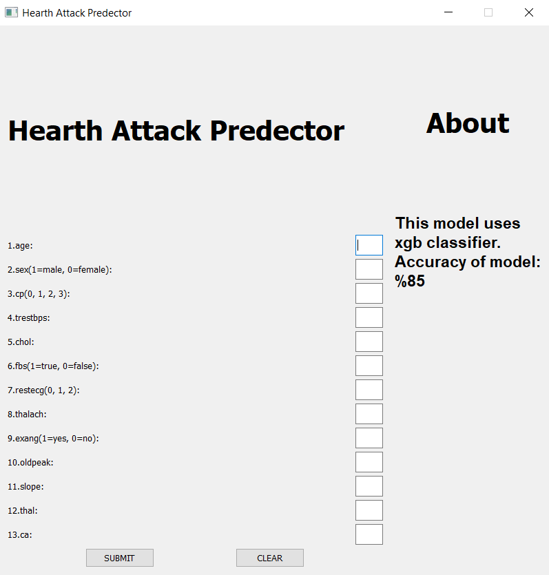

# HeartAttackPrediction




This application is built using sklearn machine learning libraries and PyQt5 for the graphical user interface. It uses the "Logistic Regression" algorithm to classify the input data with 85% accuracy. The [Heart Disease UCI](https://www.kaggle.com/ronitf/heart-disease-uci) dataset in the "Kaggle Data" section was used.

# USAGE

```bash
# Install libraries
$ pip3 install -r libraries.txt

# Get Build
$ py .\src\setup.py build

# Run it 
$ .\build\exe.win-amd64-3.10\heart_attack_prediction.exe
```

# DATASET ATTRIBUTE INFORMATION

- age
- gender
- chest pain type (4 values)
- resting blood pressure
- serum cholesterol in mg / dl
- fasting blood sugar > 120 mg/dl
- resting electrocardiographic results (0,1,2)
- maximum heart rate reached
- exercise-induced angina
- oldpeak = ST depression caused by exercise versus rest
- slope of the peak exercise ST segment
- number of major vessels colored by fluoroscopy (0-3)
- tal: 3 = normal; 6 = fixed defect; 7 = reversible defect
